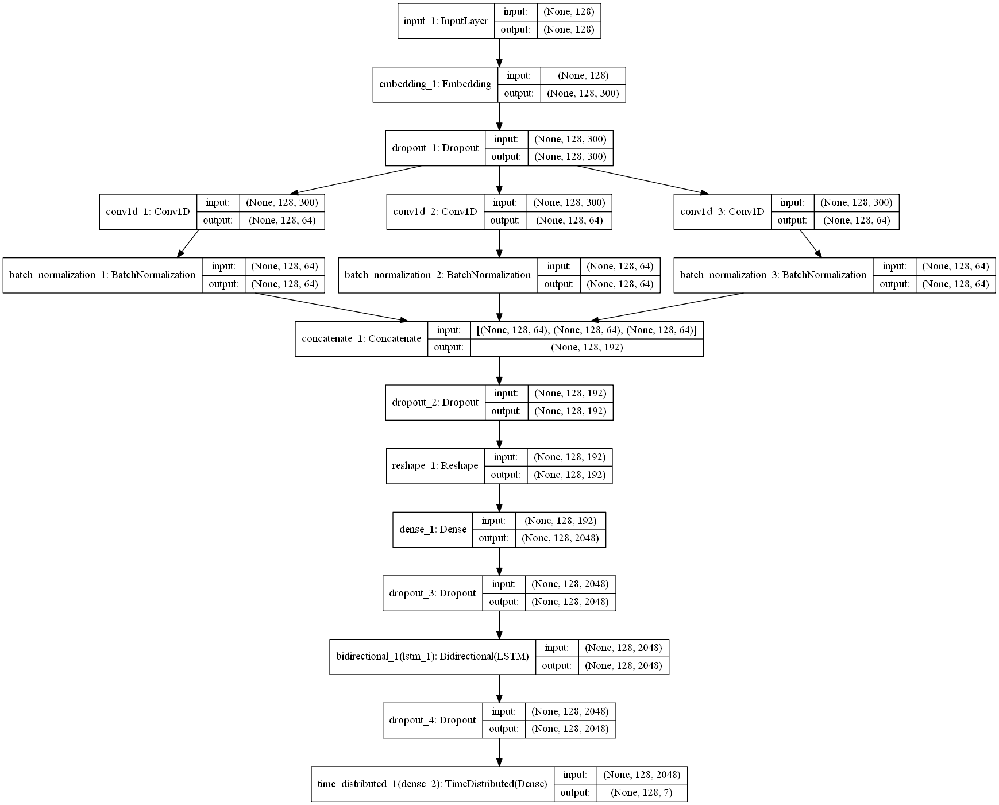
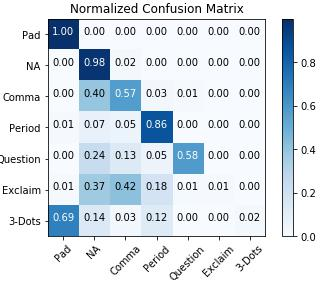
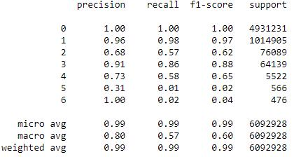
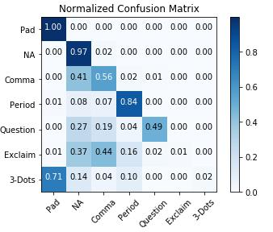
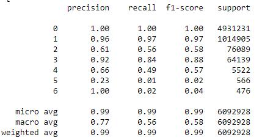

## Implementation of a CNN+LSTM PoS tagger to predict punctuations in sentences

### Summary:
Using a CNN to extract word information and feeding them into a Bi-LSTM to make improve predictions

`Input`: Sentence without punctuation  
`Output`: Prediction if the words in the sentence should contain punctuations and what they should be

### Requirements:
As a prerequisite, please kindly ensure that the [Anaconda](https://www.anaconda.com/download/) package has been installed.

Below are additional packages needed to run the code.

`Keras: 2.2.4`  
`Matplotlib: 3.0.1`  
`Python: 3.6.7`  
`Scikit-learn: 0.20.1`  
`Tensorboard: 1.12.0`  
`Tensorflow-gpu: 1.12.0`

### Project folder/files structure:
```
├── data
│   ├── embeddings
│   ├── processed
│   └── raw
├── PoS Tagger MGE.ipynb
├── PoS Tagger Ted.ipynb
├── README.md
├── results
│   ├── mge
│   └── ted
└── tf_logs
```
* `data`: Contains all (Raw and processed) data used for the model. Sub folder: **processed** holds the Ted Talks dataset (And its processed formats) to be used (Due to licensing, only the Ted Talks dataset will be available)
* `results`: Contains the screenshots of the model results (Pure LSTM, CNN+LSTM) performed on different datasets
* `tf_logs`: Contains the training log files which can be viewed using tensorboard `tensorbard --logdir=./`
* `PoS Tagger`: Notebook containing all codes required to run the project. Further descriptions are provided within to explain each code block

### Model architecture:

### Usage:

1. Clone the repo
2. Install the additional packages
3. Launch jupyter notebook `jupyter notebook`
4. Navigate to the localhost website via the browser and open the notebook
5. Run the code blocks to train the model. make predictions and, evaluate the metrics

### Results:

##### CNN+LSTM



##### LSTM



### Further Updates:

* Fleshing out readme to make it as detailed as possible