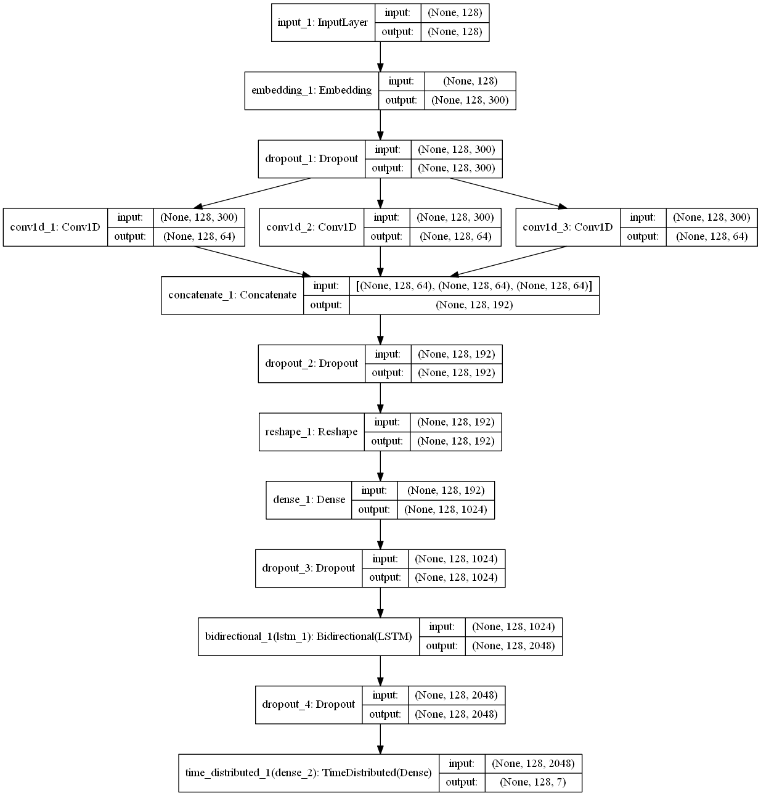
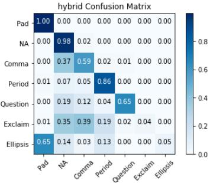
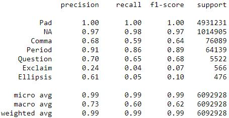
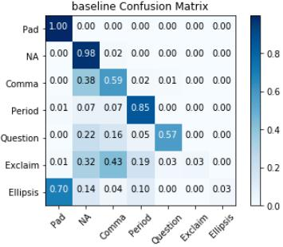
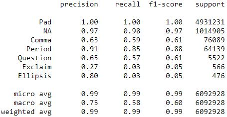
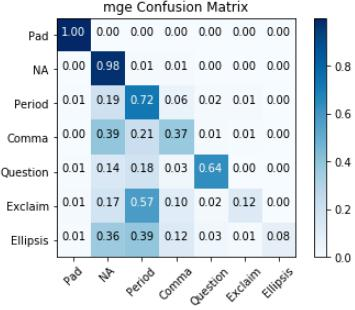
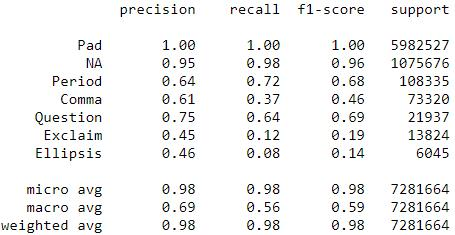

## Implementation of a CNN+LSTM Hybrid PoS tagger to predict punctuations in sentences

### Summary:
Using a CNN to extract word information and feeding them into a Bi-LSTM to make improve predictions

**Input:** Sentence without punctuation  
**Output:** Sentence with predicted punctuations

### Requirements:
As a prerequisite, please kindly ensure that the [Anaconda](https://www.anaconda.com/download/) package has been installed.

Below are additional packages needed to run the code.
```
Keras: 2.2.4  
Matplotlib: 3.0.1  
Python: 3.6.7  
Scikit-learn: 0.20.1  
Tensorboard: 1.12.0  
Tensorflow-gpu: 1.12.0
Git lfs
```

### Project folder/files structure:
```
├───data
│   ├───embeddings
│   └───processed
|   └───raw
├───images
├───models
└───tf_logs
    ├───baseline_model
    ├───mge_model
    └───ted_data_model
```

#### Folders
* **data > embeddings:** Contains the Glove embeddings
* **data > processed:** Contains the processed dataset, the words vocabulary and, labels vocabulary json files
* **data > raw:** Contains the raw dataset
* **images:** Contains the image files used for the repo
* **models:** Conatins the saved/trained model files
* **results**: Contains the screenshots of the model results (Pure BiLSTM, CNN+BiLSTM) performed on different datasets
* **tf_logs:** Contains the training log files of each model type which can be viewed using tensorboard `tensorbard --logdir=./`

#### Files:
* **Hybrid PoS Tagger Model.ipynb:** Notebook containing all codes required to run the project. Further descriptions are provided within to explain each code block
* **README.md:** Readme file for the repo

### Model architecture:
Image below displays the architecture for the Hybrid model


### Usage:
1. Clone the repo, due to the large model files, git lfs pull will be required
2. Install the additional packages
3. Launch jupyter notebook using `jupyter notebook` via bash or Anaconda command prompt
4. Navigate to the [localhost website](http://localhost:8888) via the browser and open the notebook
5. Run the code cells sequentially to train the model, make predictions and, evaluate the metrics

### Results:
##### Hybrid CNN+LSTM



##### Baseline BiLSTM



##### Comparsion using MGE dataset with Hybrid model



### Future/Possible Improvements:
* Increase dataset size
* Add attention mechanism
* Expand classes to predict names and locations